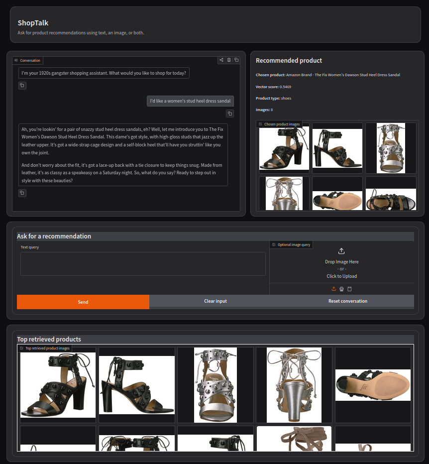

# ShopTalk - A Multimodal RAG-Style Product Recommendation Chatbot

[](https://github.com/smgutstein/ShopTalk/actions/workflows/unit_tests.yaml)


## Overview

ShopTalk implements a RAG-style product recommendation chatbot and evaluation test bed. It retrieves candidate products from a FAISS vector database built from multimodal product artifacts. Then, it uses an LLM to generate grounded, personality-aware recommendations.

The project is designed to compare text-only, image-only, and combined text-and-image product requests to determine when multimodal information improves or degrades retrieval and recommendation quality.



*Example ShopTalk session showing a product request and the grounded recommendation response.*

## Core Questions

1. When using a joint text-image representational space for a RAG-style product recommendation chatbot, does adding images to a request help produce accurate suggestions for a user?
2. Does a shared multimodal text/image representation space produce better product retrieval than separate unimodal representation spaces?
3. Can weighting or combining text and image retrieval signals improve results over the best single-modality baseline?

## Current Results

The first completed end-to-end evaluation compares text-only requests with combined text-and-image requests using the same 45-case structure and the current shared ImageBind representation space.

Each evaluation contains:

- 30 positive cases for which a suitable product should be retrieved;
- 15 missing-product cases for which the system should avoid making a recommendation;
- human-reviewed retrieval, product-decision, response-quality, and grounding judgments.

Both runs used `gpt-4o` with a temperature of `0.0`. All required human-judgment fields were completed before scoring.

### Text-Only vs. Text-and-Image

| Metric | Text only | Text + image |
|---|---:|---:|
| Target or equivalent retrieved | **83.3%** | 63.3% |
| Exact target retrieved | **50.0%** | 43.3% |
| Strict hit@1 | **46.7%** | 43.3% |
| Strict hit@5 | **83.3%** | 76.7% |
| Lenient hit@5 | 96.7% | **100.0%** |
| Mean reciprocal rank | **0.727** | 0.710 |
| Mean top-1 relevance | **1.433** | 1.267 |
| Mean retrieval quality | **1.156** | 1.067 |
| Correct product decision on positive cases | **90.0%** | 63.3% |
| Mean response quality | **1.778** | 1.667 |
| Grounded responses | **95.6%** | 88.9% |
| False recommendations on missing-product cases | **0.0%** | **0.0%** |
| Correct no-match decisions | **100.0%** | **100.0%** |

Under the current retrieval and query-construction approach, text-only requests performed better on most retrieval and response metrics. The largest differences were in target-or-equivalent retrieval, where text only led by 20 percentage points, and correct product decisions, where it led by 26.7 percentage points.

Both configurations correctly avoided recommending unavailable products in all 15 missing-product cases. This suggests that the system's no-match behavior is currently more reliable than its selection of the best product among imperfectly retrieved candidates.

These results do not establish that images are generally harmful to product retrieval. The evaluated images were found by submitting the existing text requests to an image search engine and manually selecting a seemingly relevant result. The text requests did not explicitly identify which visual characteristics mattered. Consequently, the added image could introduce irrelevant visual information rather than useful complementary evidence.

Image-only runs did not produce product recommendations and instead requested more information. This primarily reflects the current conversation policy: an unexplained image does not provide explicit enough purchase intent for the LLM to proceed confidently. It should not be interpreted as a direct measurement of image-only retrieval quality.

The next evaluation will use text requests that explicitly refer to information in the accompanying image. Later experiments will examine modality weighting, separate text and image representation spaces, and retrieval-result fusion.

The complete reviewed judgments and machine-readable scored reports are available under:

```text
server/evals/retrieval_llm_response/reviewed/
server/evals/retrieval_llm_response/results/
```

## Current Project Status

### Implemented

- Product metadata preprocessing and product-blurb generation.
- ImageBind-based embedding of product text and images in a shared representation space.
- Generation of FAISS vector-search artifacts, with optional NumPy artifacts for inspection and debugging.
- A Gradio application supporting text-only, image-only, and combined text-and-image requests.
- Retrieved-product galleries, recommendation output, and runtime diagnostics.
- Configurable LLM and application settings through `shoptalk_config.ini`.
- Docker and conda-based launch workflows.
- Automated tests covering preprocessing, configuration, retrieval helpers, vector-store behavior, conversation policy, structured responses, image handling, diagnostics, Gradio helpers, and evaluation workflows.
- Separate evaluation modules for:
  - deciding whether a conversation turn requires product search;
  - deciding how to respond after candidate products have been retrieved;
  - evaluating the complete retrieval-and-response pipeline.
- A human-review workflow that separates generated outputs, reviewed judgments, and scored results.
- A completed 45-case comparison of text-only and combined text-and-image requests using the current shared ImageBind vector store.
- A committed 12-product smoke-test fixture with product blurbs, product images,
  image-path metadata, and a prebuilt FAISS vector database.

### In Progress

- Evaluate the effect of tailoring text requests to specific images.
- Evaluate alternative text/image weighting and fusion strategies.
- Compare the shared ImageBind representation with separate text and image representation spaces.


## Architecture Overview

At a high level, ShopTalk has two components.

### Offline / Artifact Generation


The current vector generation path embeds product text and product images with ImageBind, combines the normalized text and image embeddings, normalizes the resulting product vector, and writes vector-search artifacts.

The FAISS backend writes:

```text
artifacts/vector_db/faiss/embeddings.faiss
artifacts/vector_db/faiss/product_ids.json
```

The NumPy backend writes:

```text
artifacts/vector_db/numpy/embeddings.npy
artifacts/vector_db/numpy/product_ids.json
```

The FAISS backend is the serving backend. The NumPy backend is mainly for debugging, inspection, and reproducibility checks.

### Runtime / Conversation Flow


The LLM layer is not supposed to invent products. It works from retrieved product candidates and decides whether to recommend a product or gather more information.

## Repository Structure

The repository separates offline product-data preparation, vector-artifact generation, runtime recommendation code, evaluation suites, tests, Docker support, and committed smoke-test artifacts.

See [`docs/repository_structure.md`](docs/repository_structure.md) for the expanded directory tree and descriptions of the main files.

## Full Dataset and Generated Artifacts

The repository includes a committed 12-product smoke-test fixture, but intentionally excludes the full Amazon Berkeley Objects image archive and generated full-catalog artifacts.

See [`docs/data_setup.md`](docs/data_setup.md) for the required paths, dataset preparation steps, product-blurb generation, and FAISS/NumPy vector-database commands.

## Environment Setup

ShopTalk supports two development environments:

1. **Docker**, recommended for most users because it provides a repeatable Torch, ImageBind, and FAISS environment.
2. **Conda**, useful when you need direct control of the local Python environment.

The committed smoke test can be run with either environment without downloading the full product dataset or rebuilding the vector database. Running against the full catalog requires the additional data and generated artifacts described later in this README.

### Recommended: Docker Development Environment

The Docker development environment is defined under `Dockerfiles/`. Run the helper script from the repository root:

```bash
./Dockerfiles/shoptalk_shell.sh
```

With no argument, the script builds and starts the Compose service if necessary, then opens an interactive shell inside the container.
 
Common commands:

```bash
./Dockerfiles/shoptalk_shell.sh shell      # Open a container shell
./Dockerfiles/shoptalk_shell.sh start      # Build and start in the background
./Dockerfiles/shoptalk_shell.sh status     # Show service status
./Dockerfiles/shoptalk_shell.sh logs       # Follow container logs
./Dockerfiles/shoptalk_shell.sh stop       # Stop the container
./Dockerfiles/shoptalk_shell.sh down       # Remove the container and network
./Dockerfiles/shoptalk_shell.sh restart    # Recreate the container
```

Docker uses `Dockerfiles/.env-public` for non-secret Compose defaults. OpenAI-backed application and evaluation features use the root-level `.env` file described under [LLM Setup](#llm-setup).

### Alternative: Conda Environment

Use the conda workflow when you want a local, non-containerized environment.

#### 1. Create and activate the environment

From the parent directory that will contain both `ImageBind` and this repository:

```bash
conda create --name imagebind python=3.10 -y
conda activate imagebind
```

#### 2. Install ImageBind

```bash
git clone https://github.com/facebookresearch/ImageBind
cd ImageBind
pip install .
```

#### 3. Install ShopTalk

Move to the ShopTalk repository root:

```bash
cd ../ShopTalk
pip install -e .
```

`pip install -e .` installs the package using `setup.py` and `requirements.txt`.

`requirements.txt` currently targets the development environment and includes `faiss-gpu-cu12`. Systems without compatible CUDA support should install an appropriate FAISS package instead; `faiss-cpu` is the simpler option for CPU-only use.

Keep `requirements.txt` and `Dockerfiles/requirements-docker.txt` synchronized as application, evaluation, and test dependencies change.

## Run the Smoke Test

The repository includes a small smoke-test catalog that can exercise the
complete runtime application without downloading the full Amazon Berkeley Objects
image archive or rebuilding the full vector database.

The committed fixture contains:

- 12 products: four shoes, four lamps, and four chairs;
- product blurbs for those products;
- the corresponding product images;
- image ID-to-path metadata;
- a prebuilt 1,024-dimensional FAISS vector database.

The smoke test uses the normal ShopTalk runtime path, including ImageBind query
embedding, FAISS retrieval, product-image display, conversation policy, and
LLM-generated responses. It is intended to verify that the application runs
end to end. It is not an evaluation dataset and should not be used to measure
retrieval quality.

### 1. Configure the OpenAI API key

From the repository root:

```bash
cp .env.example .env
```

Edit `.env` and set:

```text
OPENAI_API_KEY="your_openai_api_key"
```

### 2. Launch the application

From either the Conda environment or the Docker container shell, run:

```bash
./run_ShopTalk_gradio.sh shoptalk_smoke_config.ini
```

Then open:

```text
http://127.0.0.1:7860
```

Example requests:

```text
I am looking for a black table lamp.
```

```text
Recommend a wooden chair.
```

```text
I need women's dress sandals.
```

Inside Docker, the launcher binds to `0.0.0.0` so that the configured port can
be exposed to the host. On a normal local host, it binds to `127.0.0.1`.

## LLM Setup

### 1. Configure the OpenAI API key (if not already configured for smoke test)

Using OpenAI's LLMs requires one shared local API-key file at the repository root. From the repository root, create it with:

```bash
cp .env.example .env
```

Then edit `.env` and set:

```text
OPENAI_API_KEY="your_openai_api_key"
```

### 2. Configure the LLM model

The application, retrieval, data-path, server, and evaluation settings live in
`shoptalk_config.ini`. For example:

```ini
[llm]
model_name = gpt-4o
temperature = 0.1

[app]
personality = -1

[retrieval]
vector_db_output_dir = artifacts/vector_db
vector_backend = faiss
top_k = 10

[data]
product_blurbs = EDA/product_blurbs/combined_blurb_dict.json
images_csv = images.csv

[server]
server_name = auto
server_port = 7860

[evals]
model_name = gpt-4o
temperature = 0.0
```

`server_name = auto` binds to `0.0.0.0` inside Docker and `127.0.0.1`
outside Docker. Set an explicit address to override auto-detection.


## Run the Gradio App with Full Dataset

To run ShopTalk against the full product catalog, first place the full image files, `images.csv`, product blurbs, vector database artifacts, and `.env` file at their documented paths. Then run:

```bash
./run_ShopTalk_gradio.sh shoptalk_config.ini
```

Equivalent module command:

```bash
python -m server.gradio_app shoptalk_config.ini
```

Common runtime options:

```bash
python -m server.gradio_app --help
```

Note: The launcher detects when it is running inside Docker and binds Gradio to `0.0.0.0` automatically so Docker port mapping works. On a normal local host, it defaults to `127.0.0.1`. You can still override the bind address manually with `--server_name`, but that should not be necessary for the standard Docker workflow.

Examples:

```bash

# Enable debug output
./run_ShopTalk_gradio.sh shoptalk_config.ini --debug

# Force CPU usage
./run_ShopTalk_gradio.sh shoptalk_config.ini --cpu
```

The Gradio UI supports text-only queries, image-only queries, and combined text-plus-image queries.

## Run Tests

The `tests/` directory contains lightweight unit and behavior tests for verifying code correctness. They are intended to catch errors in helpers, configuration, parsing, diagnostics, vector-store loading, image-path handling, and UI helper logic without requiring a full ImageBind embedding run.

```bash
python -m pytest -q
```

## Evaluation Workflows

ShopTalk evaluates pre-retrieval search decisions, post-retrieval product-response decisions, and the complete retrieval-and-response pipeline. Reviewed end-to-end outputs are separated from generated judgments and scored reports.

See [`docs/evaluation.md`](docs/evaluation.md) for evaluator configurations, commands, output locations, and the human-review and scoring workflow.


## Suggested Next Development Steps

1. Create image-referencing text queries and compare them with the existing text-only and loosely paired text-plus-image cases.
2. Produce a paired comparison across text-only, image-only, and text-plus-image runs, including per-case wins, losses, ties, and failure analysis.
3. Test alternative text/image weighting within the current shared ImageBind representation.
4. Compare the shared ImageBind approach with dedicated text and image representations.
5. Evaluate score fusion or reranking between text and image retrieval channels.

## License

This project is released under the MIT License. See [LICENSE.md](LICENSE.md).

## Project Provenance

This work grew out of a capstone project I worked on with Raj Avasarala and Matt Belland, which may be found at [`ShopTalk_v0`](https://github.com/ravasarala/ShopTalk). Older versions of this project used a Flask server entry point. 
