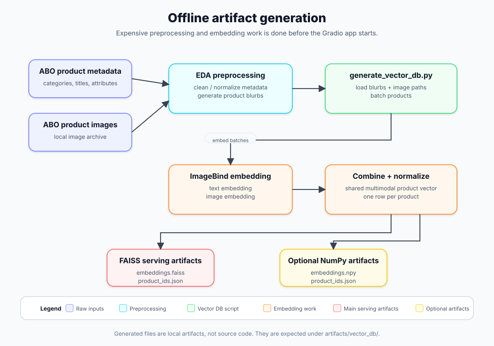
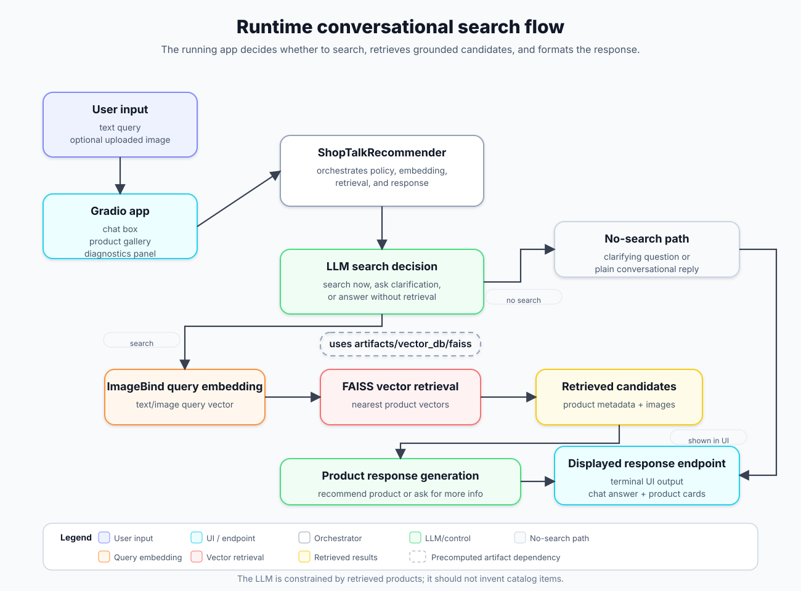

# ShopTalk - A Multimodal RAG-Style Product Recommendation Chatbot

## Overview

ShopTalk implements a RAG-style product recommendation chatbot and evaluation test bed. It retrieves candidate products from a FAISS vector database built from multimodal product artifacts. Then, it uses an LLM to generate grounded, personality-aware recommendations.

The project is designed to compare text-only, image-only, and combined text-and-image product requests to determine when multimodal information improves or degrades retrieval and recommendation quality.

## Core Questions

1. When using a joint text-image representational space for a RAG-style product recommendation chatbot, does adding images to a request help produce accurate suggestions for a user?
2. Does a shared multimodal text/image representation space produce better product retrieval than separate unimodal representation spaces?
3. Can weighting or combining text and image retrieval signals improve results over the best single-modality baseline?

## Current Results

The first completed end-to-end evaluation compares text-only requests with combined text-and-image requests using the same 45-case structure and the current shared ImageBind representation space.

Each evaluation contains:

- 30 positive cases for which a suitable product should be retrieved;
- 15 missing-product cases for which the system should avoid making a recommendation;
- human-reviewed retrieval, product-decision, response-quality, and grounding judgments.

Both runs used `gpt-4o` with a temperature of `0.0`. All required human-judgment fields were completed before scoring.

### Text-Only vs. Text-and-Image

| Metric | Text only | Text + image |
|---|---:|---:|
| Target or equivalent retrieved | **83.3%** | 63.3% |
| Exact target retrieved | **50.0%** | 43.3% |
| Strict hit@1 | **46.7%** | 43.3% |
| Strict hit@5 | **83.3%** | 76.7% |
| Lenient hit@5 | 96.7% | **100.0%** |
| Mean reciprocal rank | **0.727** | 0.710 |
| Mean top-1 relevance | **1.433** | 1.267 |
| Mean retrieval quality | **1.156** | 1.067 |
| Correct product decision on positive cases | **90.0%** | 63.3% |
| Mean response quality | **1.778** | 1.667 |
| Grounded responses | **95.6%** | 88.9% |
| False recommendations on missing-product cases | **0.0%** | **0.0%** |
| Correct no-match decisions | **100.0%** | **100.0%** |

Under the current retrieval and query-construction approach, text-only requests performed better on most retrieval and response metrics. The largest differences were in target-or-equivalent retrieval, where text only led by 20 percentage points, and correct product decisions, where it led by 26.7 percentage points.

Both configurations correctly avoided recommending unavailable products in all 15 missing-product cases. This suggests that the system's no-match behavior is currently more reliable than its selection of the best product among imperfectly retrieved candidates.

These results do not establish that images are generally harmful to product retrieval. The evaluated images were found by submitting the existing text requests to an image search engine and manually selecting a seemingly relevant result. The text requests did not explicitly identify which visual characteristics mattered. Consequently, the added image could introduce irrelevant visual information rather than useful complementary evidence.

Image-only runs did not produce product recommendations and instead requested more information. This primarily reflects the current conversation policy: an unexplained image does not provide explicit enough purchase intent for the LLM to proceed confidently. It should not be interpreted as a direct measurement of image-only retrieval quality.

The next evaluation will use text requests that explicitly refer to information in the accompanying image. Later experiments will examine modality weighting, separate text and image representation spaces, and retrieval-result fusion.

The complete reviewed judgments and machine-readable scored reports are available under:

```text
server/evals/retrieval_llm_response/reviewed/
server/evals/retrieval_llm_response/results/
```

## Current Project Status

### Implemented

- Product metadata preprocessing and product-blurb generation.
- ImageBind-based embedding of product text and images in a shared representation space.
- Generation of FAISS vector-search artifacts, with optional NumPy artifacts for inspection and debugging.
- A Gradio application supporting text-only, image-only, and combined text-and-image requests.
- Retrieved-product galleries, recommendation output, and runtime diagnostics.
- Configurable LLM and application settings through `shoptalk_config.ini`.
- Docker and conda-based launch workflows.
- Automated tests covering preprocessing, configuration, retrieval helpers, vector-store behavior, conversation policy, structured responses, image handling, diagnostics, Gradio helpers, and evaluation workflows.
- Separate evaluation modules for:
  - deciding whether a conversation turn requires product search;
  - deciding how to respond after candidate products have been retrieved;
  - evaluating the complete retrieval-and-response pipeline.
- A human-review workflow that separates generated outputs, reviewed judgments, and scored results.
- A completed 45-case comparison of text-only and combined text-and-image requests using the current shared ImageBind vector store.

### In Progress

- Evaluate the effect of tailoring text requests to specific images.
- Evaluate alternative text/image weighting and fusion strategies.
- Compare the shared ImageBind representation with separate text and image representation spaces.
- Add a small reproducible fixture or smoke-test dataset that can run without rebuilding the full product artifact collection.

## Architecture Overview

At a high level, ShopTalk has two components.

### Offline / Artifact Generation



The current vector generation path embeds product text and product images with ImageBind, combines the normalized text and image embeddings, normalizes the resulting product vector, and writes vector-search artifacts.

The FAISS backend writes:

```text
artifacts/vector_db/faiss/embeddings.faiss
artifacts/vector_db/faiss/product_ids.json
```

The NumPy backend writes:

```text
artifacts/vector_db/numpy/embeddings.npy
artifacts/vector_db/numpy/product_ids.json
```

The FAISS backend is the serving backend. The NumPy backend is mainly for debugging, inspection, and reproducibility checks.

### Runtime / Conversation Flow



The LLM layer is not supposed to invent products. It works from retrieved product candidates and decides whether to recommend a product or gather more information.

## Repository Layout

Important files and directories:

```text
EDA/                                         Offline product-data preparation
  DescriptionGenerator.py                    Generate product descriptions / blurbs
  preprocessor.py                            Product metadata preprocessing helpers
  config.ini                                 EDA/preprocessing configuration

generate_vector_db.py                        Build ImageBind/FAISS vector artifacts

server/
  gradio_app.py                              Main Gradio application

  recommender_core/                          Primary runtime recommendation package
    config.py                                Runtime config dataclasses and INI loading
    conversation_policy.py                   LLM control and recommendation policy
    diagnostics.py                           Diagnostics data structures/helpers
    llm_prompts.py                           Prompt construction helpers
    parsing.py                               Query/embedding-mode parsing helpers
    product_candidate.py                     Product candidate representation
    product_images.py                        Product image-path loading helpers
    product_vector_store.py                  FAISS/product metadata wrapper
    query_embedder.py                        ImageBind query embedding wrapper
    recommender_factory.py                   Runtime construction functions
    reply_types.py                           Structured reply/result models
    shop_talk_recommender.py                 Main recommender orchestration class
    vector_db.py                             FAISS artifact loading
    vector_query.py                          Query-vector combination/search helpers

  evals/                                     Evaluation suites and supporting artifacts
    search_decision/
      eval_search_decision.py                Pre-retrieval search-decision evaluation
      cases/                                 Search-decision test cases

    product_response_decision/
      eval_product_response_decision.py      Post-retrieval product-response evaluation
      cases/                                 Product-response test cases

    retrieval_llm_response/
      retrieval_llm_eval.py                  Generate judgments and score reviewed files
      retrieval_llm_eval_*.ini               Modality-specific evaluation configurations
      cases/                                 Text, image, and text-plus-image cases
      generated/                             Raw generated judgment files
      reviewed/                              Human-reviewed judgment files
      results/                               Scored evaluation outputs
      query_images/                          Evaluation images and source provenance
      image_case_reviewer/                   Image-search and case-review application
      run_image_case_reviewer.py             Reviewer application entry point

    retrieval_llm_eval.py                    Compatibility wrapper
    generate_retrieval_llm_judgments.py      Compatibility wrapper
    score_retrieval_llm_judgments.py         Compatibility wrapper

  recommender.py                             Compatibility import wrapper
  gradio_images.py                           Compatibility import wrapper
  shoptalk_paths.py                          Compatibility import wrapper
  static/images/                             Runtime product images (generated/downloaded)

tests/                                       Unit and lightweight behavior tests

Dockerfiles/                                 Docker development environment
  Dockerfile                                 ShopTalk development image
  docker-compose.yaml                        Compose service definition
  docker-entrypoint.sh                       Container user/setup entrypoint
  requirements-docker.txt                    Docker copy of Python dependencies
  shoptalk_shell.sh                          Docker helper script
  .env-public                                Non-secret Docker environment defaults

images/                                      Architecture diagrams and editable sources

run_ShopTalk_gradio.sh                       Launch the Gradio app
run_eval_search_decision.sh                  Run the search-decision evaluation
run_eval_product_response_decision.sh        Run the product-response evaluation
run_generate_retrieval_llm_judgments.sh      Generate retrieval/response judgments
run_score_retrieval_llm_judgments.sh         Score reviewed retrieval/response judgments
run_image_case_reviewer.sh                   Launch the image-case reviewer

shoptalk_config.ini                          App/evaluation LLM model settings
.env.example                                 Template for the local OpenAI API key
requirements.txt                             Python dependencies
setup.py                                     Package installation metadata
```

## Generated / Downloaded Files Not Tracked by Git

The repository intentionally does not include the full image archive, generated product blurb JSON, image metadata CSV, or vector database artifacts.

Expected local paths:

| Path | Purpose | Source |
|---|---|---|
| `EDA/product_blurbs/combined_blurb_dict.json` | Product metadata and generated product blurbs keyed by product ID | Generated by the EDA pipeline |
| `images.csv` | Mapping from Amazon image IDs to relative image paths | Amazon Berkeley Objects metadata |
| `server/static/images/` | Product image files used by ImageBind and the UI | Extracted from Amazon Berkeley Objects image archive |
| `artifacts/vector_db/` | Generated FAISS/NumPy vector artifacts | Created by `generate_vector_db.py` |
| `.env` | Shared local OpenAI API key for both Docker and conda/local runs | Created locally from `.env.example` |

These are local artifacts, not source files.

## Environment Setup

ShopTalk supports two development environments:

1. **Docker**, recommended for most users because it provides a repeatable Torch, ImageBind, and FAISS environment.
2. **Conda**, useful when you need direct control of the local Python environment.

Both approaches still require the local data and generated artifacts described in the following sections.

### Recommended: Docker Development Environment

The Docker development environment is defined under `Dockerfiles/`. Run the helper script from the repository root:

```bash
./Dockerfiles/shoptalk_shell.sh
```

With no argument, the script builds and starts the Compose service if necessary, then opens an interactive shell inside the container.
 
Common commands:

```bash
./Dockerfiles/shoptalk_shell.sh shell      # Open a container shell
./Dockerfiles/shoptalk_shell.sh start      # Build and start in the background
./Dockerfiles/shoptalk_shell.sh status     # Show service status
./Dockerfiles/shoptalk_shell.sh logs       # Follow container logs
./Dockerfiles/shoptalk_shell.sh stop       # Stop the container
./Dockerfiles/shoptalk_shell.sh down       # Remove the container and network
./Dockerfiles/shoptalk_shell.sh restart    # Recreate the container
```

Docker uses `Dockerfiles/.env-public` for non-secret Compose defaults. OpenAI-backed application and evaluation features use the root-level `.env` file described under [LLM Setup](#llm-setup).

After entering the container shell, launch the application from the mounted repository root:

```bash
./run_ShopTalk_gradio.sh shoptalk_config.ini
```

The launcher binds to `0.0.0.0` inside Docker so the configured port can be exposed to the host. The standard Compose configuration makes the application available on the local machine at:

```text
http://127.0.0.1:7860
```

The Docker environment does not include the full image archive, `images.csv`, generated product blurbs, or vector database artifacts. Those files must exist at the documented repository paths before the full application can run.

### Alternative: Conda Environment

Use the conda workflow when you want a local, non-containerized environment.

#### 1. Create and activate the environment

From the parent directory that will contain both `ImageBind` and this repository:

```bash
conda create --name imagebind python=3.10 -y
conda activate imagebind
```

#### 2. Install ImageBind

```bash
git clone https://github.com/facebookresearch/ImageBind
cd ImageBind
pip install .
```

#### 3. Install ShopTalk

Move to the ShopTalk repository root:

```bash
cd ../ShopTalk
pip install -e .
```

`pip install -e .` installs the package using `setup.py` and `requirements.txt`.

`requirements.txt` currently targets the development environment and includes `faiss-gpu-cu12`. Systems without compatible CUDA support should install an appropriate FAISS package instead; `faiss-cpu` is the simpler option for CPU-only use.

Keep `requirements.txt` and `Dockerfiles/requirements-docker.txt` synchronized as application, evaluation, and test dependencies change.

## Data Setup

ShopTalk expects Amazon Berkeley Objects-style images and metadata.

### 1. Download images and metadata

Download [`abo-images-small.tar`](https://amazon-berkeley-objects.s3.amazonaws.com/archives/abo-images-small.tar) from the Amazon Berkeley Objects dataset.

Extract it and move the contents of:

```text
images/small/
```

into:

```text
server/static/images/
```

After extraction, the project should contain directories like:

```text
server/static/images/00/
server/static/images/01/
...
server/static/images/ff/
```

Also place `images.csv` in the project root. If you have `images.csv.gz`, unzip it:

```bash
gunzip images.csv.gz
```

The project root should then contain:

```text
images.csv
```

### 2. Generate product blurbs

The vector DB generator expects:

```text
EDA/product_blurbs/combined_blurb_dict.json
```

A typical generation command is:

```bash
python EDA/DescriptionGenerator.py
```

Check `EDA/config.ini` and the EDA scripts for the exact local input/output paths expected by your dataset layout.

## Generate Vector DB Artifacts

From the project root, generate the default FAISS artifacts:

```bash
python generate_vector_db.py \
  --vector_backend faiss \
  --vector_db_output_dir artifacts/vector_db
```

Useful options:

```bash
python generate_vector_db.py --help
```

Common flags:

| Flag | Meaning |
|---|---|
| `--product_blurbs` | Path to generated product blurb JSON. Default: `EDA/product_blurbs/combined_blurb_dict.json` |
| `--image_root` | Root directory containing product images. Default: `server/static/images` |
| `--images_csv` | Path to image ID to image path CSV. Default: `images.csv` |
| `--vector_backend` | Artifact backend to write: `faiss` or `numpy` |
| `--vector_db_output_dir` | Output directory for generated vector artifacts. Default: `artifacts/vector_db` |
| `--batch_size` | Batch size for ImageBind embedding. Default: `128` |
| `--cpu` | Force CPU inference |
| `--skip_missing_images` | Skip products whose referenced image file is missing |
| `--debug` | Enable debug logging |

For inspection/debugging, generate NumPy artifacts instead:

```bash
python generate_vector_db.py \
  --vector_backend numpy \
  --vector_db_output_dir artifacts/vector_db
```

Serving currently expects the FAISS backend.

## LLM Setup

### 1. Configure the OpenAI API key

Using OpenAI's LLMs requires one shared local API-key file at the repository root. From the repository root, create it with:

```bash
cp .env.example .env
```

Then edit `.env` and set:

```text
OPENAI_API_KEY="your_openai_api_key"
```

### 2. Configure the LLM model

The application, retrieval, data-path, server, and evaluation settings live in
`shoptalk_config.ini`. For example:

```ini
[llm]
model_name = gpt-4o
temperature = 0.1

[app]
personality = -1

[retrieval]
vector_db_output_dir = artifacts/vector_db
vector_backend = faiss
top_k = 10

[data]
product_blurbs = EDA/product_blurbs/combined_blurb_dict.json
images_csv = images.csv

[server]
server_name = auto
server_port = 7860

[evals]
model_name = gpt-4o
temperature = 0.0
```

`server_name = auto` binds to `0.0.0.0` inside Docker and `127.0.0.1`
outside Docker. Set an explicit address to override auto-detection.


## Run the Gradio App

After the image files, `images.csv`, product blurbs, vector DB artifacts, and `.env` file are in place, run:

```bash
./run_ShopTalk_gradio.sh shoptalk_config.ini
```

Equivalent module command:

```bash
python -m server.gradio_app shoptalk_config.ini
```

Common runtime options:

```bash
python -m server.gradio_app --help
```

Note: The launcher detects when it is running inside Docker and binds Gradio to `0.0.0.0` automatically so Docker port mapping works. On a normal local host, it defaults to `127.0.0.1`. You can still override the bind address manually with `--server_name`, but that should not be necessary for the standard Docker workflow.

Examples:

```bash

# Enable debug output
./run_ShopTalk_gradio.sh shoptalk_config.ini --debug

# Force CPU usage
./run_ShopTalk_gradio.sh shoptalk_config.ini --cpu
```

The Gradio UI supports text-only queries, image-only queries, and combined text-plus-image queries.

## Run Tests

The `tests/` directory contains lightweight unit and behavior tests for verifying code correctness. They are intended to catch errors in helpers, configuration, parsing, diagnostics, vector-store loading, image-path handling, and UI helper logic without requiring a full ImageBind embedding run.

```bash
python -m pytest -q
```


## Run Evaluation Scripts

ShopTalk evaluates the recommendation pipeline at three levels:

1. whether the current conversation turn requires a product search;
2. whether retrieved candidates support a recommendation or require another response;
3. whether the complete retrieval-and-response pipeline retrieves an appropriate product and produces a correct, grounded response.

The evaluation scripts require an OpenAI API key. Each evaluator uses an INI file that records the complete run configuration.

### Search-Decision Evaluation

```bash
./run_eval_search_decision.sh
```

This evaluates whether the LLM policy makes the correct pre-retrieval decision: search now, ask for clarification, or continue without another search.

The complete default run is defined in:

```text
server/evals/search_decision/search_decision_eval.ini
```

To reproduce a different run, copy and edit that file, then select it explicitly:

```bash
./run_eval_search_decision.sh --config path/to/search_decision_eval.ini
```

The evaluator accepts no per-setting command-line overrides. Results are written to the directory configured in the INI file; the default is:

```text
server/evals/search_decision/results/
```

### Product-Response-Decision Evaluation

```bash
./run_eval_product_response_decision.sh
```

This evaluates the post-retrieval LLM decision: recommend one of the retrieved products, ask for more information, or report that the request cannot be fulfilled by the available candidates.

The complete run definition is stored in:

```text
server/evals/product_response_decision/product_response_decision_eval.ini
```

Use a different complete run configuration with:

```bash
./run_eval_product_response_decision.sh --config path/to/product_response_decision_eval.ini
```

Results are written to numbered text files under:

```text
server/evals/product_response_decision/results/
```

### Retrieval and LLM Response Evaluation

The end-to-end evaluator measures retrieval quality together with the correctness and grounding of the final LLM response. Separate configurations are provided for text-only, image-only, and combined text-and-image requests.

Generate raw judgments for a modality with:

```bash
./run_generate_retrieval_llm_judgments.sh \
  server/evals/retrieval_llm_response/retrieval_llm_eval_text_only_45.ini
```

```bash
./run_generate_retrieval_llm_judgments.sh \
  server/evals/retrieval_llm_response/retrieval_llm_eval_image_only_45.ini
```

```bash
./run_generate_retrieval_llm_judgments.sh \
  server/evals/retrieval_llm_response/retrieval_llm_eval_text_plus_image_45.ini
```

Each generated file records the user request, retrieval behavior, retrieved candidates, selected product, final response, and evidence available to the LLM.

### Human Review and Scoring Workflow

End-to-end evaluation artifacts move through three directories:

```text
server/evals/retrieval_llm_response/generated/   Raw retrieval and model outputs
server/evals/retrieval_llm_response/reviewed/    Human-reviewed judgments
server/evals/retrieval_llm_response/results/     Scored text and JSON reports
```

After reviewing a generated judgment file, score it with:

```bash
./run_score_retrieval_llm_judgments.sh path/to/reviewed_judgments.json
```

The scorer reports retrieval success, target rank, reciprocal rank, product-decision correctness, response quality, grounding, unsupported or contradicted claims, and behavior on cases where no suitable catalog product exists.

## Notes for Reviewers

This repository is best understood as a portfolio ML systems project and experimental test bed rather than a production-ready shopping application.

The strongest parts are:

- the complete path from product-data preprocessing through multimodal retrieval and grounded LLM response generation;
- separation of preprocessing, retrieval, conversation policy, UI, and evaluation components;
- support for text-only, image-only, and combined text-and-image requests;
- explicit evaluation of pre-retrieval decisions, post-retrieval response decisions, and end-to-end retrieval-and-response quality;
- a human-review workflow that preserves generated outputs, reviewed judgments, and scored results;
- automated tests covering the main helpers, configuration paths, retrieval behavior, structured outputs, UI behavior, and evaluation workflows;
- documentation for both Docker and conda-based development environments.

The main limitations are:

- the full artifact setup remains large and time-consuming;
- the repository does not yet include a small reproducible demo dataset or prebuilt smoke-test artifact set;
- the current modality comparison uses a limited hand-constructed evaluation set;
- image-only behavior and image-referencing text queries require further analysis;
- the shared ImageBind representation has not yet been compared with dedicated text and image representations;
- alternative modality weighting, score fusion, and reranking strategies remain untested;
- the project has not yet been evaluated as a production system for latency, scale, security, or sustained multi-user operation.

## Suggested Next Development Steps

1. Create image-referencing text queries and compare them with the existing text-only and loosely paired text-plus-image cases.
2. Produce a paired comparison across text-only, image-only, and text-plus-image runs, including per-case wins, losses, ties, and failure analysis.
3. Test alternative text/image weighting within the current shared ImageBind representation.
4. Compare the shared ImageBind approach with dedicated text and image representations.
5. Evaluate score fusion or reranking between text and image retrieval channels.
6. Add a small reproducible fixture or smoke-test artifact set so reviewers can run a minimal end-to-end example without rebuilding the full dataset.
7. Add screenshots or a short demonstration video of the Gradio application.
8. Limit further architecture cleanup to changes that directly improve clarity, testing, or experimental reproducibility.

## Legacy Notes

Older versions of this project used a Flask server entry point. The current app entry point is the Gradio app in:

```text
server/gradio_app.py
```

